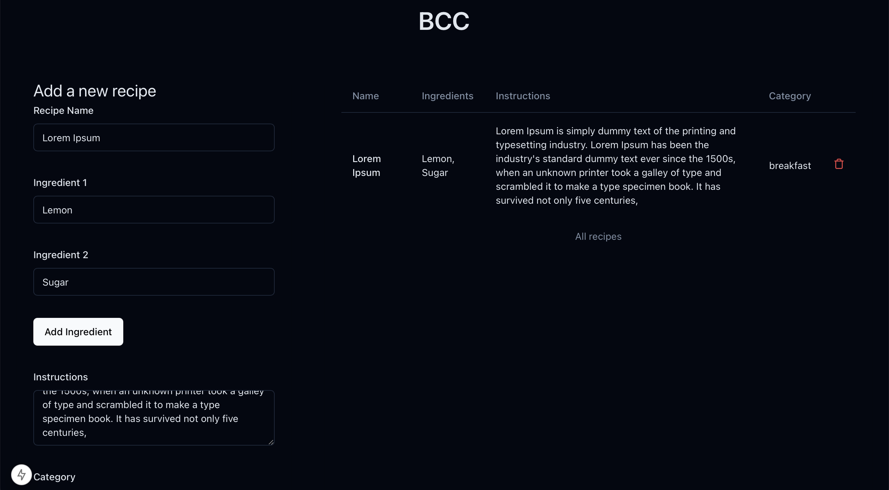
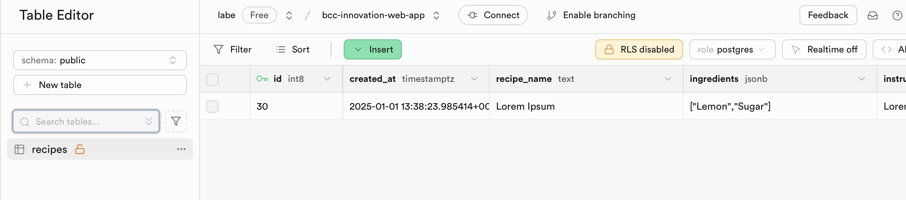

## **Tecnologías Utilizadas**
- **Framework:** [Next.js](https://nextjs.org) (React) para crear una aplicación rápida y modular.
- **Base de datos:** [Supabase](https://supabase.com) para manejar operaciones CRUD.
- **Gestión de paquetes:** [Yarn](https://yarnpkg.com) para un manejo rápido de dependencias.
- **Gestión de Node.js:** [nvm](https://github.com/nvm-sh/nvm) (o nvm-windows en Windows) para garantizar compatibilidad con la versión correcta de Node.js.

El proyecto esta creado encima de una platilla publicada recientemente, con la intención de agilizar el proceso: https://github.com/Telmiyo/supabase-auth-turborepo-boilerplate

**app**
[](https://github.com/Telmiyo/bcc-web-app)

**db**
[](https://github.com/Telmiyo/bcc-web-app)

---

## **Instrucciones de Instalación**

Puede ejecutarse tanto en macOS como en Windows. **Nota para Windows:**  
1. Usa [nvm-windows](https://github.com/coreybutler/nvm-windows) para gestionar versiones de Node.js.  
2. Sustituye el comando `cp` por `Copy-Item` en PowerShell.

### **Pasos:**

1. **Clonar el repositorio**  
   Abre una terminal y ejecuta:  
   ```bash
   git clone https://github.com/Telmiyo/bcc-web-app.git
   cd bcc-web-app
   ```

2. **Instalar la versión correcta de Node.js**  
   Utiliza `nvm` para asegurarte de estar en la versión adecuada:  
   ```bash
   nvm use
   ```

3. **Habilitar Corepack**  
   Esto asegura que Yarn esté correctamente configurado:  
   ```bash
   corepack enable
   ```

4. **Configurar las variables de entorno**  
   Copia el archivo de ejemplo y actualiza los valores proporcionados:  
   ```bash
   cp apps/web/.env.example apps/web/.env
   ```
   - **Nota para Windows:** Usa este comando en PowerShell:
     ```powershell
     Copy-Item apps\web\.env.example apps\web\.env
     ```
   Luego, edita el archivo `.env` en el directorio `apps/web` para agregar las credenciales y configuraciones necesarias.

5. **Instalar dependencias**
   Ejecuta el siguiente comando en la terminal, asegurate de estar en la raíz del proyecto:
   ```bash
   yarn install
   ```

6. **Construir la aplicación**
   Genera los archivos necesarios para la ejecución:
   ```bash
   yarn build
   ```

7. **Iniciar la aplicación en modo de desarrollo**
   Ejecuta el servidor local con:
   ```bash
   yarn dev
   ```
8. Accede a http://localhost:3000

---

## **Uso de Asistentes de IA**
Durante el desarrollo de esta aplicación, se utilizó **ChatGPT** para los siguientes propósitos: 
- Proporcionar sugerencias sobre la estructura del README y mejorar la claridad de las instrucciones.
- Optimizar el flujo de instalación para garantizar compatibilidad entre sistemas operativos.

---

## **Decisiones Técnicas y Mejoras Futuras**
### **Decisiones Técnicas:**
1. **Next.js:** Se eligió por su facilidad para manejar rutas dinámicas y su capacidad para renderizado del lado del servidor (SSR). 
2. **Supabase:** Ofrece una solución rápida y robusta para implementar bases de datos y autenticar usuarios sin necesidad de configurar un backend complejo.
3. **Yarn:** Más rápido que npm y compatible con monorepositorios, lo que facilita la gestión de paquetes.

### **Sugerencias para Mejoras Futuras:**
1. **Autenticación de usuarios:** Implementar un sistema de autenticación para que cada usuario pueda gestionar sus propias recetas.
2. **Filtrado y búsqueda:** Añadir funcionalidad para buscar recetas por nombre o categoría.
3. **Despliegue:** Preparar la aplicación para un despliegue en plataformas como Vercel o AWS para que sea accesible globalmente.
4. **Escalabilidad:** Migrar a una arquitectura más robusta, como GraphQL, si el número de recetas o usuarios aumenta significativamente.

---

pd: el readme ha sido actualizado a posteriori para ofrecer una clara guia de la instalación.
